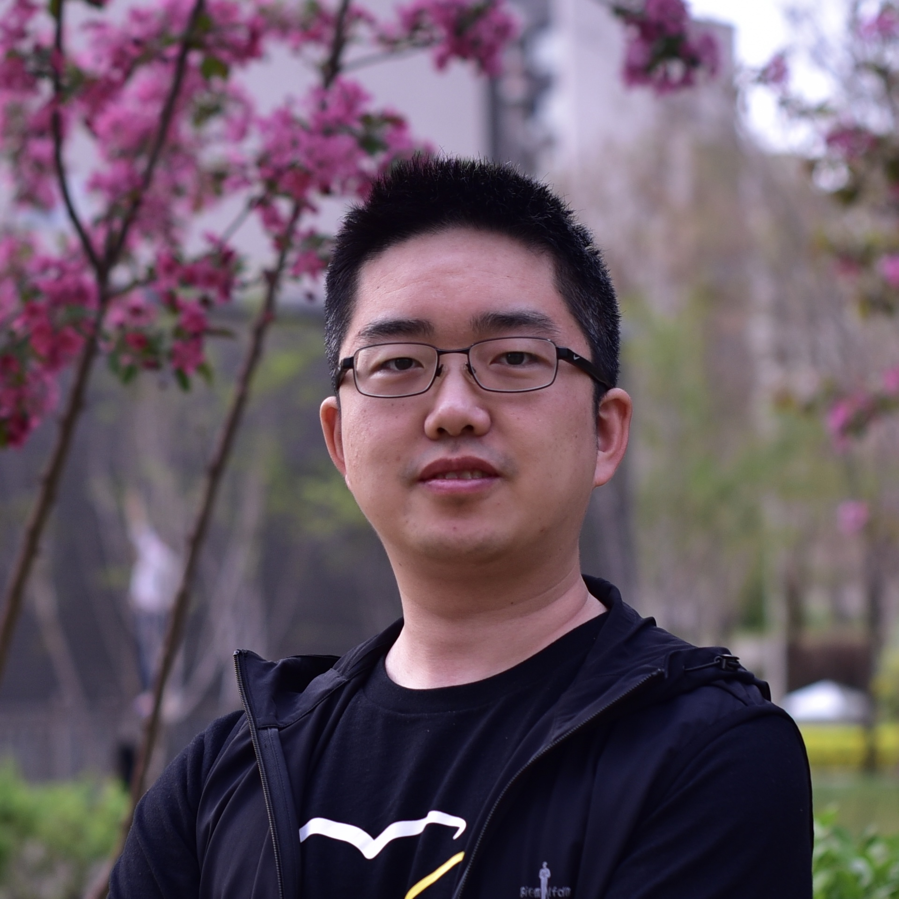
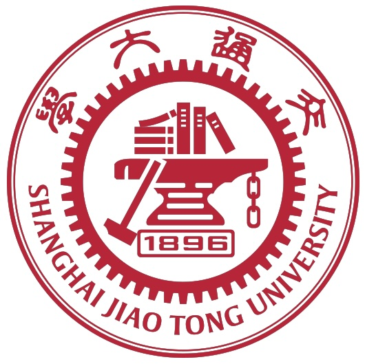

<section class="hero">
  
  

    <h1>Yifan Men, Ph.D.</h1>
    

      <h3>Staff Engineer, Active Safety</h3>
      

        <strong>Algorithm R&D, Intelligent Driving</strong> 
        <strong>Chery Intelligentization Center</strong>
      

    

    

      
<strong>Phone:</strong> (517) 775-2964 / +86 19535885865 (China)

      
<strong>Email:</strong> menyifan (at) mychery.com

    

  

</section>

## Education

  

    

      
      

        <h3>Michigan State University Aug 2013 - May 2019</h3>
        
Doctor of Philosophy in Mechanical Engineering

      

    

  

  

    

      
      

        <h3>Shanghai Jiao Tong University Sep 2009 - Jul 2013</h3>
        
Bachelor of Science in Mechanical Engineering and Automation (Honor Class)

      

    

  

## Awards and Honors

  <ul class="list">
    <li><strong>Shanghai Magnolia Talent Plan Pujiang Project</strong>, 2024</li>
    <li><strong>Pudong New Area "Pearl Elite Talent" Program</strong>, 2023</li>
  </ul>

